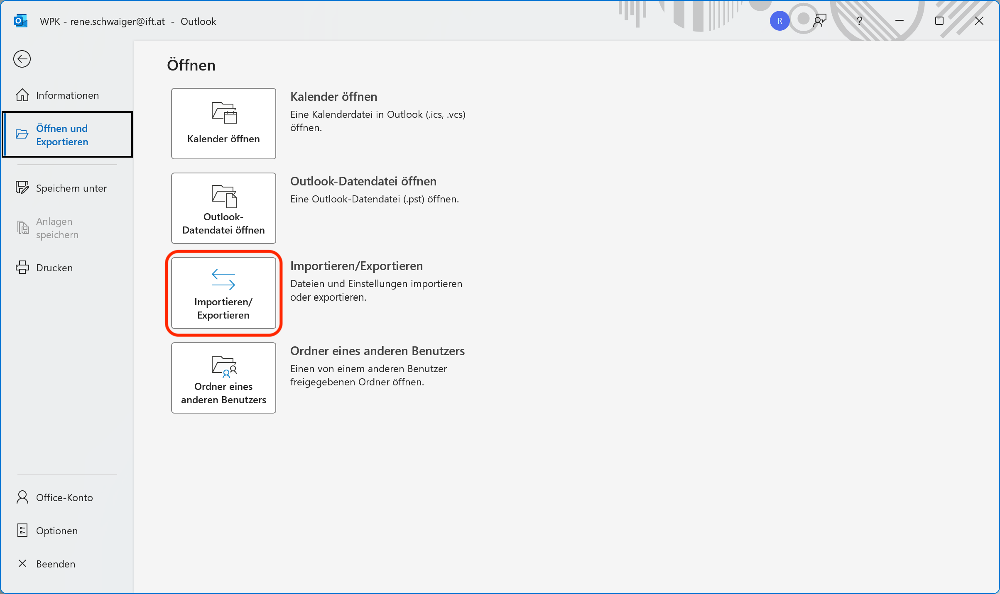
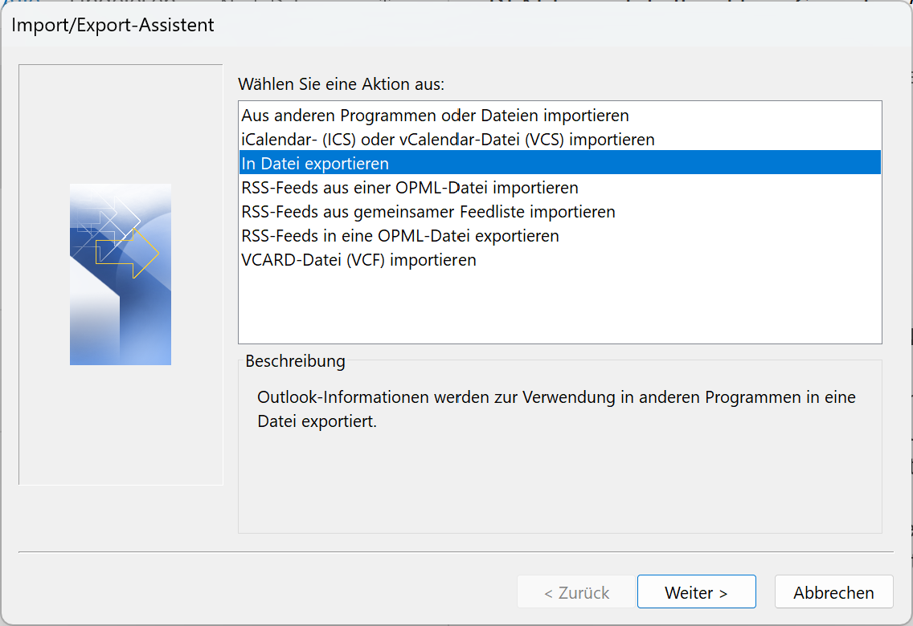
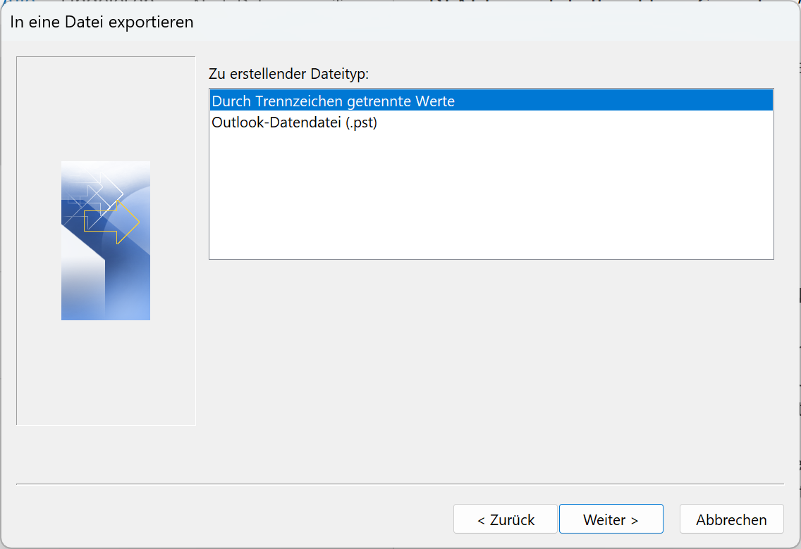
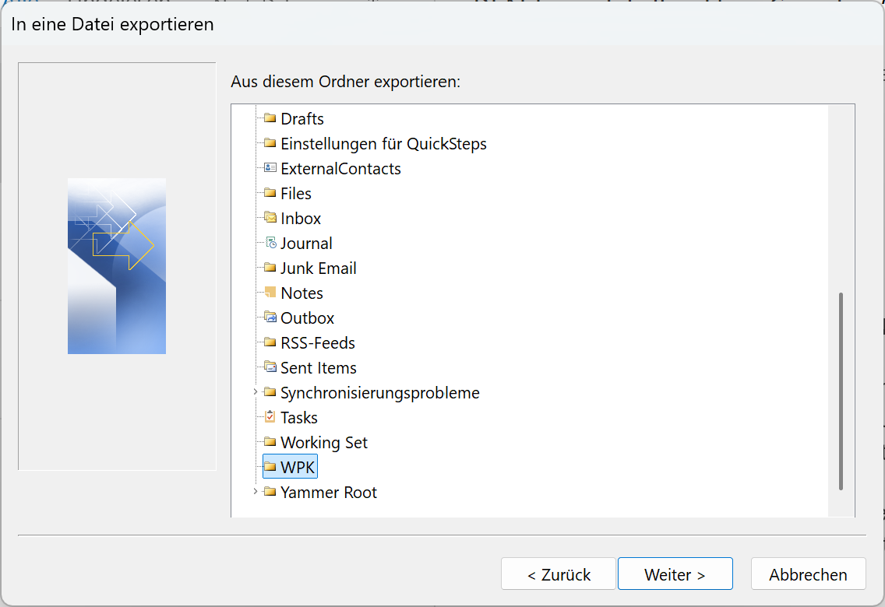
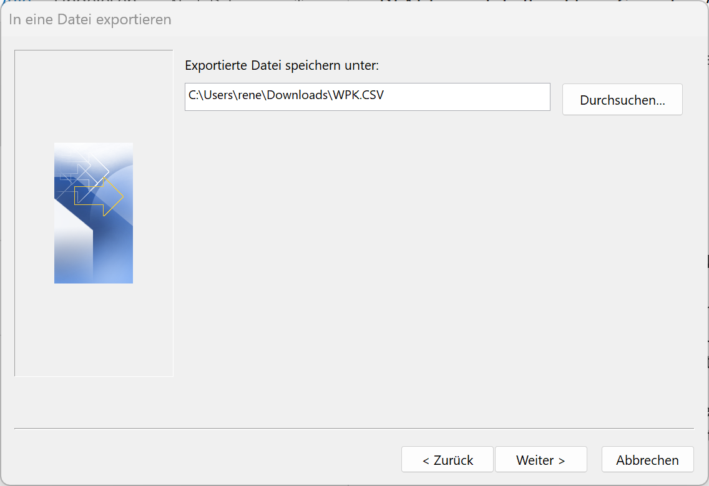
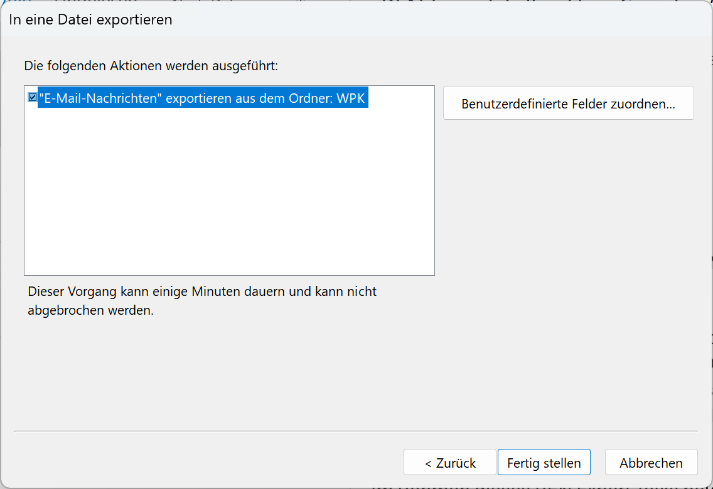

# WPKonverter

A script to convert registration data for the “Wiener Produktionstechnik-Kongress” (WPK) into an Excel file.

## Requirements

- [Python 3.12](https://www.python.org) or later

  **Note:** When you install the software, please do not forget to enable the checkbox **“Add Python to PATH”** in the setup window of the installer.

## Installation

1. Open Microsoft Terminal
2. Install the package with `pip`

   ```sh
   pip install wpkonverter
   ```

## Usage

### Preparation

1. Open Outlook Classic
2. Move WPK mails into folder e.g. one named “WPK”
3. Click on “Datei”
4. Click on “Öffnen und Exportieren”
5. Click on “Importieren/Exportieren”

   

6. Click on “In Datei exportieren” and “Weiter”

   

7. Click on “Durch Trennzeichen getrennte Werte” and “Weiter”

   

8. Click on “Durch Trennzeichen getrennte Werte” and “Weiter”

   

9. Select the folder from step 2 (e.g. “WPK”) and click on “Weiter”

   

10. Choose the folder (e.g. `Downloads`) and the filename (e.g. `WPK.CSV`) for the exported file and click on “Weiter”

    

11. Click on “Fertig stellen” to store the file

    

### Conversion

1. Open “Windows Terminal”
2. Execute the following command:

   ```sh
   wpkonverter ~/Downloads/WKP.CSV
   ```

   **Note:** The command above assumes that you stored the CSV file from Outlook in a file called `WPK.CSV` in the `Downloads` folder of the current user

## Development

### Release

**Note:** Please replace `<VERSION>` with the version number e.g. `0.0.1` in the text below

To release a new version of WPKonverter, please use the following steps:

1. Switch to the `main` branch

   ```sh
   git switch main
   ```

2. Check that the [**CI jobs** for the `main` branch finish successfully][GitHub Actions]

   [GitHub Actions]: https://github.com/ift-tuwien/WPKonverter/actions

3. Change the version number and commit your changes:

   ```sh
   just release <VERSION>
   ```

   **Note:** [GitHub Actions][] will publish a package based on the tagged commit and upload it to [PyPi](https://pypi.org/project/wpkonverter/).

4. Publish your release on GitHub:

   ```sh
   gh release create
   ```

   1. Choose the tag for the latest release
   2. As title use “Version `<VERSION>`”, e.g. “Version 0.0.1”
   3. Choose “Write my own”
   4. Paste the release notes for the latest version into the text editor window
   5. Save and close the text file
   6. Answer “N” to the question “Is this a prerelease?”
